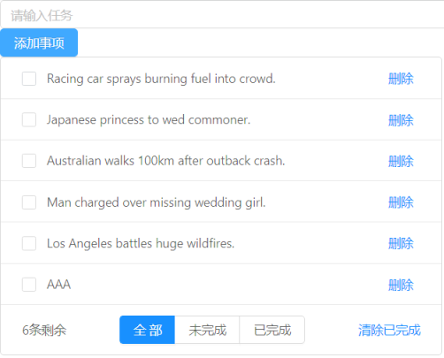

# todo

## 说明
项目效果如图所示: 

这是一个基于 Vue + Vuex 实现的待办事项(todo)项目. 项目使用见下文命令.

## Project setup
```
npm install
```

### Compiles and hot-reloads for development
```
npm run serve
```

### Compiles and minifies for production
```
npm run build
```

### Lints and fixes files
```
npm run lint
```

### Customize configuration
See [Configuration Reference](https://cli.vuejs.org/config/).
